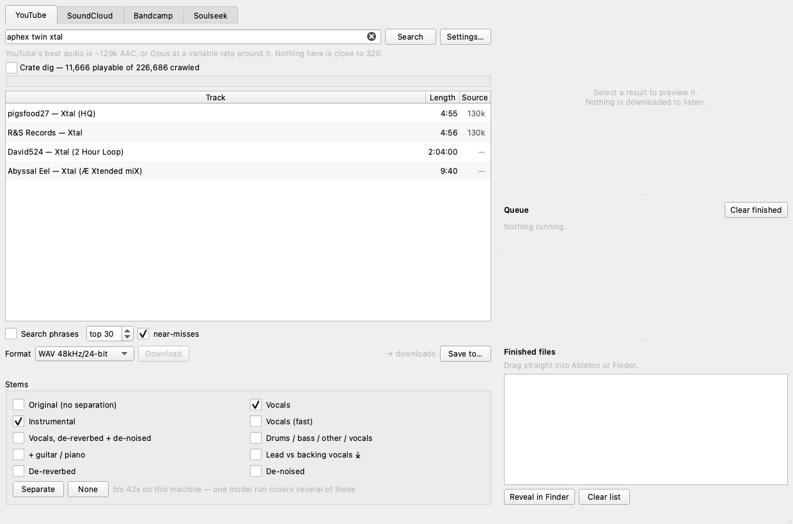
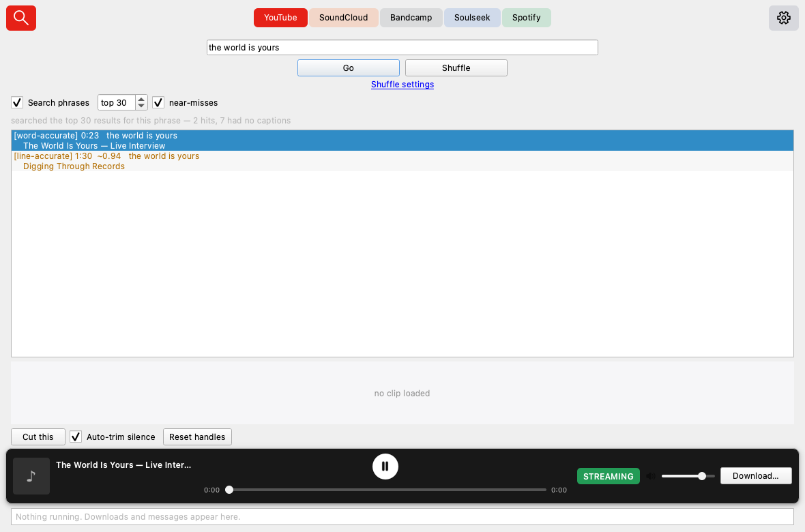
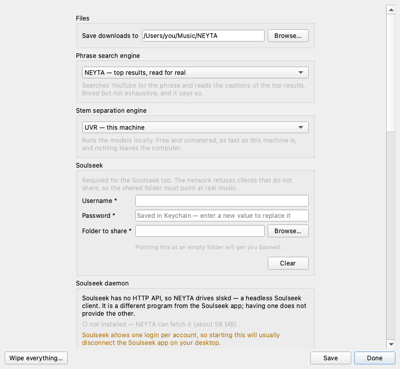

# NEYTA

Search, preview, cut and stem-split audio from YouTube, SoundCloud, Bandcamp
and Soulseek — then drag the result straight into Ableton.

Native macOS app. Nothing needs setting up to start: three of the four tabs
work with no account at all.



---

## What it does

**Four sources, one contract.** The search bar, result list, export dialog,
activity strip and drag tray are written once. The tab bar swaps the
provider; nothing above it knows which service it is pointed at.

**One question, asked once.** Format, separation and destination are decided
in a dialog that opens when you ask for a file — on Download, on Cut, on
Separate — and closes again. It states what the original already is, flags
the option that would keep it that way, and marks the ones that would not.

**It tells you the truth about bitrate.** Every result shows what the source
actually has, measured rather than advertised, and every option that would
inflate a file without adding information is marked:

```
! mp3_320   MP3 320kbps
    upscale — source is 130k, this makes a 2.5× larger file with no added detail
```

There is no 320 on YouTube or SoundCloud. Their real ceilings are ~129k AAC
and 160k AAC. Bandcamp and Soulseek are the two tabs that can hand you a
genuine master, and the app says so rather than pretending the four sources
are equivalent.

**Stem separation with an honest estimate.** All eight UVR presets, with the
time estimate calibrated on *your* machine — the first run of each preset is
timed and every later estimate comes from what it actually did. Until then it
says "first run on this machine" instead of inventing a number.

**Phrase search.** Type words someone said; get the millisecond they said them.



**Drag out.** The **Downloaded** tab — the app's second group, which takes
the whole window rather than a column beside the results — carries a
`text/uri-list` of real `file://` paths, the same flavour Finder puts on the
pasteboard, so dropping into a Live arrangement works exactly as dragging
from Finder does.

---

## Getting started

```bash
./tools/setup.sh              # builds both environments, ~5 minutes
.venv-neyta/bin/python -m neyta doctor
```

Then double-click the included `NEYTA.app`, or drag it to the Dock. Regenerate
the launcher and its icon with `.venv-neyta/bin/python tools/make_app.py`.

`doctor` prints what this machine can actually do:

```
  ✓ python      3.11.15
  ✓ symlinks    none dangling
  ✓ ffmpeg      7.1 — uvr-local (static)
  ✓ yt-dlp      2026.07.04
  ✓ PySide6     6.11.1 with QtWebEngine
  ✓ keychain    Keyring
  ✓ uvr-local   8 presets
  ✓ uvr models  1.4 GB in models/
  ✓ samplette   11,666 playable of 226,686
  ! slskd       not bootstrapped
```

### If you move the project folder

Rerun `./tools/setup.sh`. Virtualenvs store absolute paths and do not survive
being moved — this repo has been bitten by that once already, so `doctor`
checks for it and the app bundle says so in a dialog rather than failing
silently. The checked-in app itself locates the repository relative to its
own position.

---

## The tabs

| tab | ceiling | account | notes |
|---|---|---|---|
| **YouTube** | ~129k AAC, or Opus at a variable rate | none | phrase search and crate dig live here |
| **SoundCloud** | 160k AAC | none | some label uploads are DRM-protected |
| **Bandcamp** | FLAC / WAV / AIFF / ALAC, or a 128k preview | none | lossless where the artist enabled downloading |
| **Soulseek** | whatever the peer has | **required** | the only tab that reliably reaches real FLAC and true 320 |

Bandcamp has no fixed ceiling: it is a property of the release, not the
service. On a downloadable one nothing is marked as an upscale, because there
is no bitrate to inflate past. On a preview-only one, MP3 320 is flagged
against its 128k.

### Soulseek needs two things from you

1. **A free account** at [slsknet.org](https://www.slsknet.org) or from any
   Soulseek client.
2. **A folder to share.** The network bans clients that only take. Point it at
   real music.

Both go in Settings.



**slskd is not the Soulseek app.** Soulseek's protocol is proprietary TCP with
no HTTP API, so scripting it means running slskd, a separate headless client.
Having the desktop app installed does not provide it. NEYTA can fetch slskd
(~58 MB, self-contained — no Homebrew, no .NET) from Settings, or use one you
installed yourself.

**Soulseek allows one login per account**, so starting slskd will usually
disconnect the Soulseek app on your desktop. NEYTA never starts the daemon on
its own — only when you press Start.

---

## Crate dig

`samplette-local` crawls Discogs → YouTube → MusicBrainz → AcousticBrainz into
a SQLite library. NEYTA reads it **read-only** and shuffles through it with
filters on style, genre, region, key and tempo — *1970s Brazilian jazz-funk in
F minor between 90 and 100 BPM*, and keep digging inside that.

A shuffled track is an ordinary YouTube result, so it flows into the same
export dialog and drag tray as anything you searched for.

Two honest caveats:

- Only about 5% of the crawled rows have been resolved to a playable video
  yet. The panel shows both numbers.
- Roughly **45%** of those videos refuse their audio stream with HTTP 403 —
  rights restriction, measured across a random sample, and not something any
  player client works around. `shuffle --get` skips to the next crate item
  rather than failing, and reports how many it skipped.

---

## Phrase search

Reads the captions of the top N search results and finds where your words are
spoken. It is **not** an index of all of YouTube — the panel says *"searched
the top 30 results for this phrase"*, because that is what it did.

Hits come in two qualities, and the app never conflates them:

| badge | source | accuracy | behaviour |
|---|---|---|---|
| **word-accurate** | auto-generated captions | ±50 ms | lands on the syllable |
| **line-accurate** | human-uploaded captions | ±2 s | opens with the trim handles active |

Automatic captions carry a `tOffsetMs` per word; human-uploaded ones carry
none at all — measured at 1,930 word offsets versus zero. That difference
drives the badges, the padding and the trim behaviour.

Selecting a hit seeks the embedded player; nothing is downloaded to audition a
phrase. Cutting one transfers only the matched span, then silence-detect
tightens the edges.

---

## Command line

The whole engine works without the UI.

```bash
neyta search "boards of canada"          # all four tabs
neyta formats <url>                      # the real stream ladder
neyta get <url> --format wav_48_24       # verified 48000Hz · pcm_s24le
neyta get <url> --start 12 --end 20      # exact cut (YouTube only)
neyta phrase "words someone said" --get 1
neyta shuffle --region Brazil --year 1970-1979 --tempo 90-110 --get
neyta stems track.wav --pick vocals,instrumental
neyta stems --list                       # every preset, with your machine's speed
neyta doctor
```

---

## Layout

```
neyta/
  config.py          paths, format matrix, measured ceilings
  settings.py        preferences + Keychain credentials
  core/
    engine.py        yt-dlp facade: search / extract / download
    convert.py       ffmpeg: transcode, trim, probe, silence, peaks
    captions.py      json3 → word stream, both caption qualities
    phrase.py        search-then-verify pipeline and matcher
    stems.py         UVR driver + on-machine calibration
    samplette.py     read-only crate-dig library
    jobs.py          background queue: progress, cancel, retry
    cache.py         sqlite: captions never expire, searches do
    naming.py        "Artist - Title [stem].ext", collision-safe
  providers/         base contract + youtube / soundcloud / bandcamp / soulseek
  ui/                window, results, export dialog, activity, preview, tray
  vendor/            slskd download, config, supervision
```

Two Python environments on purpose: NEYTA's own (PySide6, yt-dlp) and
`uvr-local`'s (torch, onnxruntime). They never have to agree about a shared
dependency — NEYTA shells into uvr-local's interpreter and reads JSON back.

---

## Tests

```bash
.venv-neyta/bin/python -m pytest              # fast suite, no network
.venv-neyta/bin/python -m pytest -m ui        # offscreen Qt
.venv-neyta/bin/python -m pytest -m integration   # live services
```

Fixtures are checked in and regenerable with `tools/refresh_fixtures.py`. When
a live test fails while its offline twin passes, the fixture has drifted from
the service — regenerate it rather than loosening the test.

---

## Credentials

macOS Keychain, via `keyring`. Nothing sensitive is written to disk in
plaintext by NEYTA.

The one exception is `slskd.yml`, which must contain the Soulseek password
because the daemon has no other way to receive it. It is written `0600` inside
the app's support directory, serialised by PyYAML rather than by hand, and the
daemon's API is bound to `127.0.0.1/32` only.

Settings has a per-service **Clear** and a single **Wipe everything** that
empties the Keychain entries, preferences, caches and temporary media in one
action. Music you have already downloaded is never touched.

YouTube cookies are **off by default**. Everything works unauthenticated;
a cookies file only helps with rate limiting and age-gated videos, and
automated access with account cookies runs against YouTube's terms.
